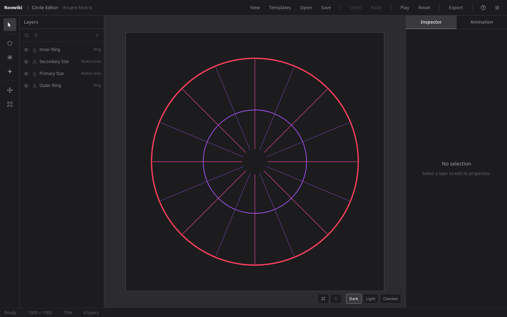

# Circle Editor — Portfolio Notes

**Project:** Circle Editor  
**Type:** Technical Artist portfolio piece  
**Stack:** React 19 · TypeScript · Vite · SVG · Zustand · Zod · Tailwind CSS v4  
**Live demo:** [circle-editor.pages.dev/circleeditor/](https://circle-editor.pages.dev/circleeditor/)

---

## What This Demonstrates Professionally

- **Purpose-built creative tool** — built from scratch with no off-the-shelf editor base; the entire application architecture was designed for this specific workflow
- **Procedural and non-destructive workflow** — seed-based generator followed by live parametric editing; no destructive flattening at any stage
- **Layer-based editing model** — each layer is an independent mathematical object with its own geometry, color, transform, and visibility state
- **SVG rendering and editor architecture** — custom SVG canvas with a separate editor overlay, resolution-independent rendering, and a clean export path that constructs output from data rather than cloning the DOM
- **Reliable undo/redo** — snapshot-based history with a defined 50-state budget; trivially correct and fully testable
- **PNG output suitable for game-engine VFX workflows** — transparent RGBA PNG at up to 4096 × 4096; intended for import as a `Texture2D` in Unreal Engine 5 VFX materials
- **Automated testing** — 896 unit tests and 287 E2E tests covering geometry, state, history, persistence, and the full export pipeline
- **Production deployment with CI/CD** — Cloudflare Pages deployment on every push to `main` via GitHub Actions

---

## What It Is

Circle Editor is a browser-based creative tool for designing magic-circle visual effects —
the geometric, symbolic compositions used in game VFX, films and illustrations.
It combines a **procedural generator** with a **non-destructive layer editor** and a direct
path to exporting transparent PNG textures for Unreal Engine 5.

The goal was to produce a purpose-built workflow where an artist can go from
blank canvas → procedurally assisted composition → hand-refined layers → exported game asset
without touching a general-purpose vector editor or writing a single shader.

---

## Technical Decisions

### 1. SVG as the rendering representation

The entire canvas is a single `<svg>` element rendered by the browser.
No WebGL, no Canvas 2D, no external rendering library.

**Why SVG:**
SVG is resolution-independent, inspectable in DevTools, and has a direct rasterization path to PNG via an `HTMLCanvasElement` and `ctx.drawImage`. For a tool whose primary job is drawing circles and line arrays, browser SVG is precisely as capable as needed — and avoids a rendering dependency that would complicate the export pipeline.

SVG also makes the layer model concrete: a Ring layer is literally a `<circle>` element. A Radial Lines layer is a `<g>` containing `count` `<line>` elements, computed at render time from parametric properties. Debugging in DevTools shows the exact SVG that will be exported.

**The tradeoff:** very high layer counts (hundreds of radial-lines layers with large `count`) would eventually stress browser SVG performance. The current design targets 5–30 layers, which is well within SVG capacity.

### 2. Snapshot-based undo/redo, not a command pattern

Every undoable action serializes the entire project state to a JSON snapshot and pushes it onto the history stack. Undo restores the previous snapshot.

**Why snapshots:**

- Project state is small (typically < 20 KB per snapshot; no bitmaps).
- Snapshots are trivially correct — there are no command-desynchronization bugs.
- Snapshots are easy to test deterministically: push → undo → assert state equals previous snapshot.
- 50 snapshots × ~20 KB ≈ 1 MB maximum memory: well within budget.

A command-based (action-replay) model would offer no significant benefit at this project scale and introduces implementation complexity — particularly around deserialization of every action type and ensuring all actions are reversible. Snapshots eliminate that class of bugs entirely.

### 3. Five separate state domains

State is split into five distinct Zustand stores: project, editor, viewport, history, and animation.

**Why separated:**
Each domain has a different persistence contract. Only project state and user preferences are ever written to local storage or project files. Editor state (selection, active tool, panel visibility) is transient. Viewport state (zoom, pan) is transient. History state (undo/redo snapshots) is transient. Animation state (playback, elapsed time, animated offsets) is transient and non-destructive.

Separating these domains means a component that only cares about viewport zoom subscribes to the viewport store only — a layer radius change never triggers a viewport re-render, and vice versa.

### 4. Parametric Radial Lines, not stored geometry

A Radial Lines layer stores `count`, `innerRadius`, `outerRadius`, `startAngle`, `strokeWidth`, and `color`. Line endpoints are computed at render time. There are no stored `(x1, y1, x2, y2)` coordinates in the project file.

**Why parametric:**
Changing `count` from 8 to 12 on a stored-geometry model would require regenerating and re-storing 12 new line objects. On a parametric model, it is a single integer write and a re-render. The parametric model is also more compact, more predictable, and makes the inspector controls exact: `count = 8` always means exactly 8 lines, uniformly spaced.

The tradeoff is that individual lines within a Radial Lines layer are not independently editable. This is an intentional scope constraint — the tool targets compositions, not individual element micro-editing.

### 5. Export is a separate code path from the editor SVG

The editor canvas is an SVG containing both the `#artwork` group and an `#editor-overlay` group (grid, guides, selection handles, transform handles). These are rendered live inside the same `<svg>` element.

At export time, the export engine constructs a **separate standalone SVG string** from project state alone — it does not clone or reference the editor SVG. This standalone SVG contains only the `#artwork` equivalent. It then gets rasterized to a `<canvas>` element at the requested pixel dimensions and exported as PNG via `canvas.toBlob('image/png')`.

**Why a separate code path:**
Cloning the live editor SVG and stripping editor-only elements is brittle — any new editor element added in the future must also be excluded from the clone, and the list is easy to forget. Building the export SVG from scratch from project state makes the boundary explicit: the export is defined by the data model, not by the DOM.

### 6. Zod schema with format sentinel for project files

Project files are JSON with a required `__magic_circle__: true` top-level field and a `version` string. Zod validates every imported file before it is allowed to replace the current project.

**Why a sentinel field:**
A user might accidentally try to open a generic JSON file with the file picker. The sentinel field immediately rejects anything that is not a Circle Editor project file without inspecting the internal structure. Zod provides structured validation errors that can be shown to the user.

**Backward compatibility note:**
The internal identifiers (`__magic_circle__`, `magic-circle-editor:autosave`, `.mce.json`) are frozen regardless of future product name changes. Renaming them would invalidate all existing saved project files.

---

## Challenges

### Coordinate system design

The editor operates in three coordinate domains simultaneously:

- **Project coordinates** (logical units, origin at canvas center, extent ±500)
- **SVG element coordinates** (same as project, within the viewBox)
- **Screen coordinates** (CSS pixels, origin at browser top-left)

The SVG viewBox is always `"-500 -500 1000 1000"` regardless of zoom level.
Zoom and pan are applied as CSS transforms on a wrapper `
`, not as viewBox changes.
This means project coordinates are stable: panning never changes a layer's stored position.

The challenge was implementing the `screenToProject` conversion correctly under arbitrary zoom and pan, and using it correctly in all pointer event handlers for drag-to-move, drag-to-rotate, and drag-to-scale. Each handle type requires a different geometric computation: move is a delta translation in project space, rotate is an angle delta in project space, scale is a ratio of current-distance to start-distance in local (rotated) layer space.

### Keeping animation strictly non-destructive

The animation preview system adds per-layer rotation speed and scale pulsing. The constraint is that the animation store must never write to the project store, even during playback.

The implementation uses a separate `animatedTransforms` map keyed by layer ID. Layer renderers read both the base transform (from the project store) and the current animated offset (from the animation store) and compute the final visual transform at render time. The project store is never touched during playback. Undoing a property change while animation is paused undoes the project edit, not the animation state.

Enforcing this boundary required careful store design: the animation store exposes a `tick(deltaMs)` action that updates the animated transforms, but that action has no path to the project store. The renderer components are the only place where the two transforms are composed, and they are read-only with respect to both stores.

### Transform handle math

Rotation and scale handle interactions require geometric computations in local (layer-rotated) coordinate space.

For the rotation handle:

- On `pointerdown`, record the angle from the layer center to the pointer in project space.
- On `pointermove`, compute the new angle and apply the delta to the starting rotation.

For the scale handles:

- On `pointerdown`, record the pointer position in the layer's local space (inverse-rotated).
- On `pointermove`, compute the ratio of the current local pointer position to the start local position, per axis. Multiply by the starting scale to get the new scale.
- Shift-key constraint: take the larger of the two axis scale factors and apply it to both axes (proportional scale relative to the starting aspect ratio).

Getting the coordinate frame right — particularly undoing the layer's rotation to compute the scale ratio in local space — required careful attention to transform order.

### E2E testing for file downloads

Playwright does not provide a browser filesystem after a download completes — the download object gives a temporary file path on the test runner's disk. The download + re-upload test has to:

1. Listen for the `download` event before clicking Save.
2. Read the temporary file from disk using Node.js `fs.promises.readFile`.
3. Feed the raw bytes back into the hidden file input via `setInputFiles` with a synthetic buffer.

This is a non-obvious pattern that required understanding how Playwright intercepts downloads differently from a real browser.

### SVG → PNG rasterization in jsdom

The export pipeline uses `URL.createObjectURL` and `HTMLCanvasElement.toBlob` — browser APIs that jsdom does not implement. Unit tests for `exportPng.ts` required a fully mocked environment: stubs for `URL.createObjectURL`/`revokeObjectURL`, a synthetic `Image` class with a synchronous `onload` trigger via `Promise.resolve().then()`, and mocked `canvas.getContext`/`toBlob`. These stubs had to be added to the global test setup so that `vi.spyOn` could override them per-test.

---

## Unreal Engine 5 Integration

The intended final step (Phase 15F) is to use a Circle Editor export inside an Unreal Engine 5 VFX system.

### Export format

Circle Editor exports transparent PNG at up to 4096 × 4096. This maps directly to what Unreal Engine's **Texture Editor** imports: a standard RGBA PNG with a pre-multiplied or straight alpha channel. The transparent background is the default export option precisely because UE5 VFX materials expect alpha-masked textures.

### Material application

In Unreal Engine 5, the exported PNG is imported as a `Texture2D` asset. A simple **Unlit Material** or **Translucent Material** reads the texture's RGB and Alpha channels. The Alpha channel drives opacity masking so the magic circle renders only where the artwork is present, with no visible rectangle.

For particle-based VFX, the material is applied to a **Niagara Mesh Renderer** or a **Sprite Renderer** emitting a plane. The rotation and scale animation that Circle Editor previews in-browser can be replicated as Niagara module parameters (rotation rate, size over lifetime) applied to the particle, making the in-editor animation preview a direct workflow analogue of the final engine effect.

### Why this pipeline makes sense

SVG-based rendering at export time is resolution-independent. A magic circle exported at 4096 × 4096 will have clean anti-aliased edges at any engine display resolution. The parametric construction (circles, line arrays) produces perfectly smooth arcs with no rasterization artifacts — the browser SVG renderer produces sub-pixel accurate geometry before the Canvas rasterization step.

---

## Test Coverage

Artist tools must be reliable — a broken undo or a corrupted export silently damages a creator's work. The test suite covers geometry, state, history, persistence, and the full export pipeline to ensure that refactors do not introduce regressions.

| Metric                  | Result      |
| ----------------------- | ----------- |
| Unit tests              | 896 passing |
| E2E tests               | 287 passing |
| `src/utils/` statements | 99.52 %     |
| `src/utils/` branches   | 94.02 %     |

---

## Project Status

| Phase | Name                                                        | Status        |
| ----- | ----------------------------------------------------------- | ------------- |
| 0–14  | Core editor (all phases)                                    | **COMPLETED** |
| 15A   | RooWiki UI system + themes                                  | **COMPLETED** |
| 15B   | QA, UX polish, accessibility                                | **COMPLETED** |
| 15C   | Branding and product identity                               | **COMPLETED** |
| 15D   | README and portfolio documentation                          | **COMPLETED** |
| 15E   | Deployment                                                  | **COMPLETED** |
| 15F   | Final portfolio assets (screenshots, social metadata, docs) | **COMPLETED** |
