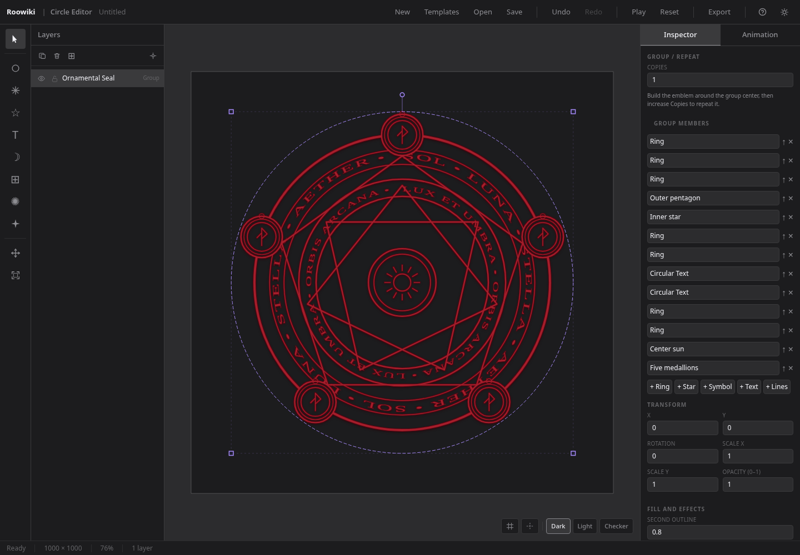
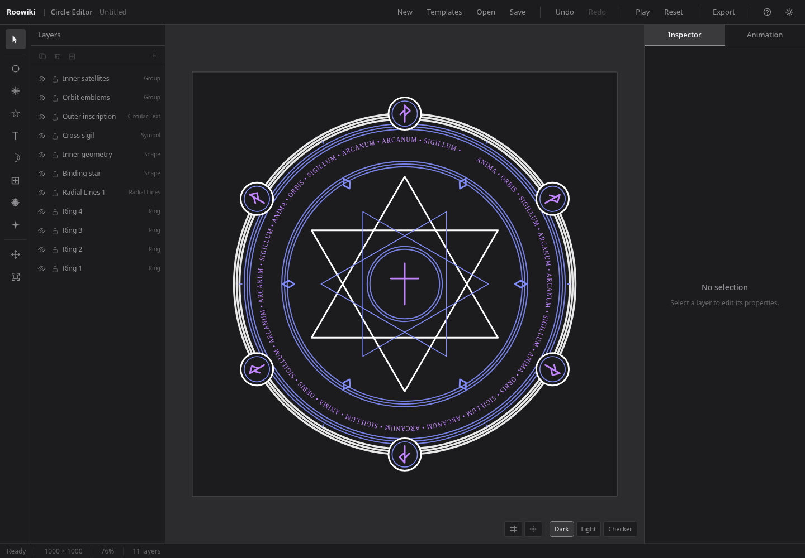

# Circle Editor

A browser-based creative tool for designing magic circles — the geometric, symbolic compositions
used in game VFX, films and illustrations. Combines a procedural generator with a non-destructive
layer editor, and exports transparent PNG textures ready to import into Unreal Engine 5.

---

## Live Demo

**[circle-editor.pages.dev/circleeditor/](https://circle-editor.pages.dev/circleeditor/)**

## Screenshot


---

## Workflow

1. **Generate** — seed-based procedural generator produces a Ring + Radial Lines composition as a starting point
2. **Edit** — adjust each layer's geometry, color, and transform non-destructively; nothing is ever flattened
3. **Export** — rasterize at 512–4096 px with a transparent background, ready to import as a `Texture2D` in Unreal Engine 5

---

## Features

- **Ring styles** — simple circles, concentric rings, divided bands, and arcs; choose Ring style in the inspector. Decorative details extend inward from the outer radius.
- **Editable artwork** — rings, radial lines, stars (pointed or interlaced), polygons, circular text, SVG symbols and nested groups
- **Radial patterns** — spokes, clock marks, fans and tilted lines, with adjustable spread, alternating lengths and line ends
- **Non-destructive editing** — all layers remain live mathematical objects; nothing is flattened
- **Procedural generator** — live preview, Classic / Arcane / Celestial / Mechanical styles, symmetry, seeded variations, canvas fitting, and replace or append workflows
- **Five templates** — pre-built designs ready to edit
- **Canvas transform controls** — move, rotate, and scale layers directly by dragging
- **Animation preview** — per-layer rotation speed and scale pulsing, non-destructive
- **PNG export** — 512–4096 px, transparent or solid background, full project or single-layer
- **Project persistence** — auto-save to local storage + download/upload `.mce.json`
- **Light / Dark themes** — persistent across sessions
- **Keyboard shortcuts** — Undo/Redo, Duplicate, Delete, nudge, help panel (`?`)

---

## Technology Stack

| Concern    | Technology               |
| ---------- | ------------------------ |
| Framework  | React 19                 |
| Language   | TypeScript (strict mode) |
| Build tool | Vite 8                   |
| Rendering  | SVG (browser-native)     |
| State      | Zustand 5                |
| Validation | Zod 3                    |
| Styling    | Tailwind CSS v4          |
| Unit tests | Vitest 3                 |
| E2E tests  | Playwright               |

---

## Getting Started

### Prerequisites

- Node.js ≥ 18
- npm ≥ 8

### Install

```bash
npm install
```

### Development server

```bash
npm run dev
```

Opens the editor at `http://localhost:5173/circleeditor/`.

### Production build

```bash
npm run build
```

---

## Available Scripts

| Script                  | Description                                   |
| ----------------------- | --------------------------------------------- |
| `npm run dev`           | Start the Vite development server             |
| `npm run build`         | Type-check and produce a production build     |
| `npm run preview`       | Preview the production build locally          |
| `npm run typecheck`     | Run TypeScript type-checking without building |
| `npm run lint`          | Run ESLint                                    |
| `npm run lint:fix`      | Run ESLint and auto-fix                       |
| `npm run format`        | Check formatting with Prettier                |
| `npm run format:write`  | Auto-format all files                         |
| `npm run test`          | Run unit tests (single pass)                  |
| `npm run test:watch`    | Run unit tests in watch mode                  |
| `npm run test:coverage` | Run unit tests with coverage report           |
| `npm run test:e2e`      | Run Playwright end-to-end tests               |

---

## Deployment

Circle Editor is deployed to **Cloudflare Pages** via **GitHub Actions** continuous deployment.

- Production branch: `main` — every push triggers a build and deploy automatically
- Build output is served under the `/circleeditor/` subpath
- Public URL: **[circle-editor.pages.dev/circleeditor/](https://circle-editor.pages.dev/circleeditor/)**

---

## Project Documentation

- [Architecture](ARCHITECTURE.md)
- [Project File Format](PROJECT_FORMAT.md)
- [Development Roadmap](ROADMAP.md)
- [Portfolio Notes](PORTFOLIO.md)

## Advanced artwork workflow

Use the left toolbar to add a star/polygon, circular text, symbol or group.
Shift-click layers in the Layers panel, then choose **Group selected layers**.
Edit a member from the group inspector; changes update every repeated copy.
Copies, distance, initial angle and orientation control circular repetition.

**Fill and effects** provides solid fill, transparent cutouts, a second outline,
glow and shadow. A cutout removes artwork beneath it; turn off Solid fill to leave
a transparent opening in the PNG. Effects and cutouts are included in PNG export.
SVG import accepts vector geometry, removes active/external content, and recolors
the symbol. Convert text to paths before importing.

An editable example with circular lettering, an interlaced star and five repeated
medallions is available as [a project file](public/examples/ornamental-seal.mce.json).
Open it with **Open** in the editor.



## Composed procedural designs

Arcane combines interlaced stars, ritual inscriptions and rune seals. Celestial
uses starbursts, open orbits and lunar/solar motifs. Mechanical uses polygon cores,
indexed bands and geometric emblems. Complexity adds inner geometry and satellites;
Inscriptions and Orbit emblems can be switched off independently. Seeds reproduce
both geometry and ornaments, and all generated parts remain editable. Classic
retains the simple ring/line generator.



Complex group effects use a cached preview during wheel zoom and panning. The sharp
vector artwork returns after navigation stops; PNG export always uses the vectors.

### VFX color controls

Open **Color adjustments** below Layers in the left sidebar to apply a color to every unlocked
layer, including nested groups and their effects. White, Black and Grayscale
provide quick monochrome conversions; Undo restores the previous palette.
For a white-on-black mask, choose White, then Export → Background → Color
with black. Keep the transparent export background for an alpha texture.
Locked layers retain their colors. Opacity and transparent cutouts are preserved.

Layer stroke, fill, glow, outline and shadow controls include VFX swatches and
editable hex values (three or six digits, with or without `#`).

**Add Symbol** includes a visual gallery of 14 additional vector sigils: Fire,
Water, Air, Earth, Mystic eye, Pentagram, Hexagram, Trident, Lightning, Infinity,
Hourglass, Crystal, Eclipse and Spiral. Choose a thumbnail or use the Symbol
menu. All symbols support color, transforms, effects, undo and PNG export.

The texture picker includes rendered thumbnails for Solid, Grain, Worn ink,
Fibers, Hatching, Crosshatch, Dots, Scales, Cracks and **Thorns**. Thorns are
available on rings (including arcs and decorated rings) and radial lines: they
add real spikes along the stroke. Strength adjusts spike height, Scale adjusts
spacing, and Seed varies their shape. Spikes inherit the line color and effects;
export bounds include their full extent. Other patterns modulate ink transparency.

Directional patterns on rings and radial lines follow the stroke's local direction,
including arcs, concentric/divided rings and tilted radial lines. Repeats are spaced
by distance along the stroke, and closed rings fit a whole number of repeats to
avoid a visible seam. Texture thumbnails use the same rendering as the artwork
and PNG export. Grain and worn ink remain isotropic surface noise.

The left **Color adjustments** tool includes Hue, Saturation and Lightness.
Set the sliders and click Apply adjustments to modify the existing palette of
unlocked layers and effects in one undoable step. The sliders reset after applying.
Reset clears pending slider values; Undo restores an applied change. Tint and
monochrome actions are also available in the same panel.
